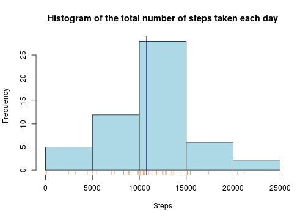
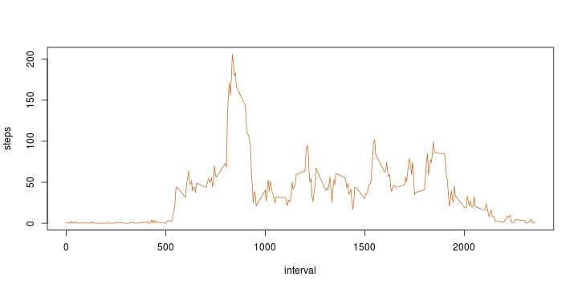
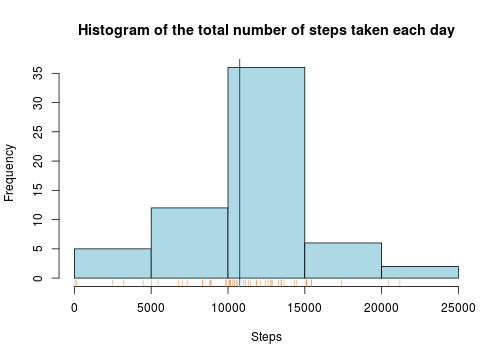
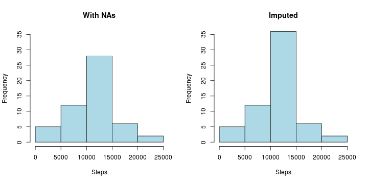
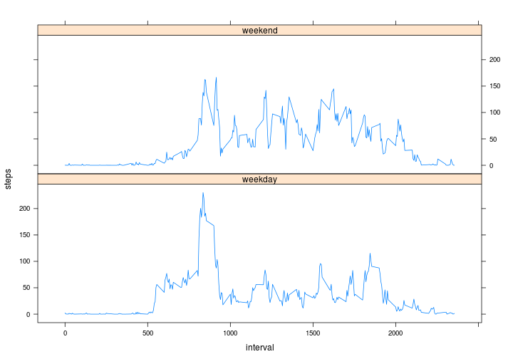

# Reproducible Research: Peer Assessment 1

## Loading and preprocessing the data


```r
data <- unz("activity.zip", "activity.csv")  # Unzip file
data <- read.csv2(data, sep = ",")           # Read file as data frame
data$date <- as.Date(data$date)              # Convert column to Date type
```


## What is mean total number of steps taken per day?

> Calculate the mean and median total number of steps taken per day.


```r
total_steps  <- data
sum_steps    <- aggregate(steps ~ date, FUN = sum, data = total_steps, na.action = na.pass)
mean_steps   <- mean(sum_steps$steps, na.rm = TRUE)
median_steps <- median(sum_steps$steps, na.rm = TRUE)
```


```r
mean_steps
```

```
## [1] 10766
```

```r
median_steps
```

```
## [1] 10765
```


> Make a histogram of the total number of steps taken each day


```r
title = "Histogram of the total number of steps taken each day"
hist(x = sum_steps$steps, xlab = "Steps", col = "lightblue", main = title)
abline(v = mean_steps, col = "navyblue")
rug(sum_steps$steps, col="chocolate")
```

 


## What is the average daily activity pattern?

> Make a time series plot (i.e. type = "l") of the 5-minute interval (x-axis)
and the average number of steps taken, averaged across all days (y-axis)


```r
steps_interval <- aggregate(steps ~ interval, FUN = mean, data = total_steps, na.rm = TRUE)
plot(steps ~ interval, data = steps_interval, type = "l", col = "chocolate")
```

 


> Which 5-minute interval, on average across all the days in the dataset,
contains the maximum number of steps?


```r
steps_interval[which.max(steps_interval$steps), ]$interval
```

```
## [1] 835
```


## Imputing missing values

> Calculate and report the total number of missing values in the dataset (i.e. the total number of rows with NAs)


```r
sum(!complete.cases(data))
```

```
## [1] 2304
```


> Devise a strategy for filling in all of the missing values in the dataset. The strategy does not need to be sophisticated. For example, you could use the mean/median for that day, or the mean for that 5-minute interval, etc.

I will use the mean values of the corresponding 5-minute intervals to impute missing values.

> Create a new dataset that is equal to the original dataset but with the missing data filled in.


```r
imputed_data <- data
for (i in 1:nrow(imputed_data)) {
    if (is.na(imputed_data$steps[i])) {
        index_imputed <- which(steps_interval$interval == imputed_data[i, ]$interval)
        imputed_data$steps[i] <- steps_interval[index_imputed, ]$steps
    }
}
## This basically makes a lookup to the previously created `steps_interval` data frame
## and assigns the mean step value of the corresponding interval to the missing value
```


> Calculate and report the mean and median total number of steps taken per day.


```r
sum_steps_imputed    <- aggregate(steps ~ date, FUN = sum, data = imputed_data, na.action = na.pass)
mean_steps_imputed   <- mean(sum_steps_imputed$steps, na.rm = TRUE)
median_steps_imputed <- median(sum_steps_imputed$steps, na.rm = TRUE)
```


```r
mean_steps_imputed
```

```
## [1] 10766
```

```r
median_steps_imputed
```

```
## [1] 10766
```


> Make a histogram of the total number of steps taken each day.


```r
title = "Histogram of the total number of steps taken each day"
hist(x = sum_steps_imputed$steps, xlab = "Steps", col = "lightblue", main = title)
abline(v = mean_steps_imputed, col = "navyblue")
rug(sum_steps_imputed$steps, col="chocolate")
```

 


> Do these values differ from the estimates from the first part of the assignment?

- **Yes**, they do differ. Side-by-side figures can be seen below for reference.

 


> What is the impact of imputing missing data on the estimates of the total daily number of steps?

- The **mean** value **did not change** due to imputing method (which imputes based on the mean value of corresponding 5-minute interval).  
- The **median** had an **insignificant increase** after the imputed values were added.

## Are there differences in activity patterns between weekdays and weekends?

> Create a new factor variable in the dataset with two levels – “weekday” and “weekend” indicating whether a given date is a weekday or weekend day.


```r
imputed_data$day <- "weekday"                                   # Assuming all days are weekdays
weekend = c("Saturday", "Sunday")                               # Defining vector of weekend days
for (i in 1:nrow(imputed_data)) {
        if (weekdays(imputed_data[i, ]$date) %in% weekend) {    # If day in `weekend days` vector
            imputed_data[i, ]$day <- "weekend"                  # Set day to "weekend"
        }
}
```


> Make a panel plot containing a time series plot (i.e. type = "l") of the 5-minute interval (x-axis) and the average number of steps taken, averaged across all weekday days or weekend days (y-axis). 


```r
library(lattice)
steps_interval_day <- aggregate(steps ~ interval + day, imputed_data, mean)
xyplot(steps ~ interval | day, data = steps_interval_day, layout = c(1, 2), type = "l")
```

 


